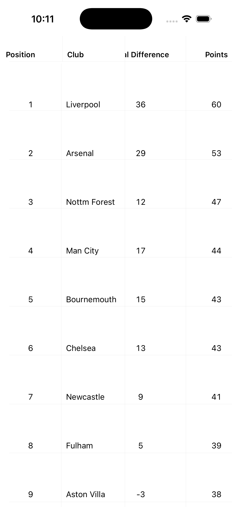

# Tournament Table – SwiftUI Sticky Scroll Demo

A SwiftUI proof-of-concept demonstrating a football tournament table with:

- sticky header row
- sticky left columns
- synchronized horizontal scrolling
- unified vertical scrolling

This project focuses on solving the scrolling and layout challenge rather than building a full production system.

---

## Demo

### iPhone


### iPad


You can also watch the screen recording:

▶️ [Demo Video](docs/Demo.mov)

---

## Features

- Sticky header that stays visible while scrolling vertically
- Fixed left columns (Position + Club)
- Horizontally scrollable stats columns
- Header and body scroll perfectly in sync
- Retina-accurate 1px separators
- Responsive layout for iPhone and iPad
- Accessibility labels for screen readers
- Static sample Premier League data
- Lazy rendering for vertical rows to support large datasets

---

## Architecture Overview

This is intentionally a lightweight architecture to highlight the scrolling solution.

Key components:

### `TournamentTableView`
Main table layout.

- Splits the table into fixed left + scrollable right sections
- Uses GeometryReader to scale columns dynamically
- Handles sticky header and vertical scrolling

### `SyncedHScrollView`
UIKit bridge that enables scroll synchronization.

SwiftUI does not expose horizontal scroll offset, so this wraps `UIScrollView` using `UIViewRepresentable` and shares scroll position via a binding.

Two instances (header + body) share the same offset state to stay synchronized.

### `Hairline`
Reusable 1-pixel separator view using display scale for retina accuracy.

### Models
Clean domain models representing tournament data.

- Codable
- type-safe enums
- computed goal difference

---

## Why UIKit is used

SwiftUI currently does not provide direct access to horizontal scroll offset.

To synchronize the header and body scrolling, this project wraps `UIScrollView` and exposes its offset through a SwiftUI binding.

This avoids preference hacks and provides smooth, native scrolling behavior.

---

## Project Structure

```
TournamentTableDemo/
├── Components/
│   ├── Hairline.swift
│   └── SyncedHScrollView.swift
├── Models/
│   ├── TournamentModels.swift
│   └── StandingsColumns.swift
├── Views/
│   ├── ContentView.swift
│   └── TournamentTableView.swift
├── Theme.swift
├── SampleData.swift
└── TournamentTableDemoApp.swift
```

---

## How to Run

1. Open `TournamentTableDemo.xcodeproj` in Xcode
2. Select an iPhone or iPad simulator
3. Press ⌘R

---

## Production Considerations

For a real production app, this would evolve to include:

- ViewModel layer for async data loading
- Repository pattern for networking + caching
- dynamic type support
- UI tests for scroll behavior
- accessibility table semantics
- large dataset optimizations

The goal of this repository is to demonstrate a focused UI engineering solution while showing awareness of how it would scale in a real system.

